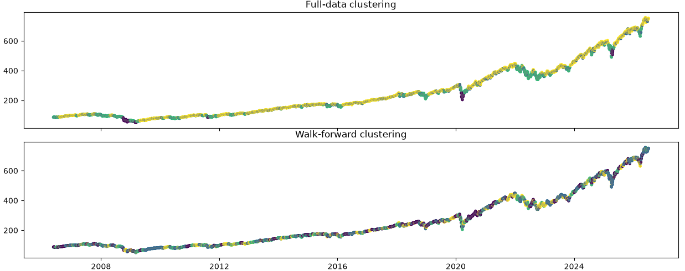

# Market Regime Detection using Machine Learning

**Can we automatically identify market environments from historical price data?**

# Goal

This project looks at different features of market regimes in SPY: returns, volatility, momentum, trend, volume change. The idea of the project is to see what kinds of clusters form when we perform k-means clustering on these features.
To go into more detail on the features:
1. Returns measure the daily percentage change in price and capture the short-term direction of the market.
2. Volatility is the rolling standard deviation of returns and measures how turbulent or calm the market is.
3. Momentum compares the current price with its value 20 trading days earlier, capturing medium-term price strength.
4. Trend is the ratio of the 20-day moving average to the 100-day moving average, indicating whether the market is generally trending upward or downward.
5. Volume Change measures the day-to-day percentage change in trading volume and attempts to capture unusual market participation during periods of stress or excitement.

# Method

First I extracted the data and placed it into a csv file. I converted that into a dataframe and adjusted each of the relevant values accordingly.
Then I graphed k over inertia to see what the optimal k value was. My assumption was that I would see an elbow in the data and it would be easy to find k, but that did not happen. Instead, I saw a smooth diminishing curve over k. The lack of a pronounced elbow suggests that the data may not naturally separate into a small number of well-defined clusters. This is consistent with the idea that market regimes exist on a continuum rather than as sharply distinct states, although this experiment alone cannot establish that conclusion. I picked k=4 because it looked like part of the steepest area in the curve, though it could've been any value from 4-8.

Next I performed a clustering with access to the full dataset. It worked well: it visually connected temporally distinct periods, like 2008 and 2020. It also seperated grinding bull markets from choppier bear markets. 

One problem, however, was that I was using full history data. This has two effects. Firstly, clusters should not be able to form according to future data, as that is not very realistic in the real world of the market. Second, every point across time contributed to an equal weighting in the kmeans output. To fix this, I created a loop where the cluster prediction for each day only depends on the last 250 days. This way, recent values matter, and kmeans cannot train on future data.

Then, I attempted to do some comparisons. I compared according to the NMI and ARI, and did a timeline strip graph. The results will be discussed below.

# Results

Both NMI and ARI were close to zero, indicating very little agreement between the full-data clustering and the walk-forward clustering. This initially appears surprising, since both methods operate on the same features. However, the walk-forward approach repeatedly retrains K-means on a changing dataset, causing cluster centers to move over time. Small changes in the fitted centroids can produce different cluster assignments, particularly near cluster boundaries. As a result, much of the disagreement likely reflects instability introduced by repeated refitting rather than fundamentally different market structure.
Additionally, K-means cluster labels are arbitrary. Cluster "0" from one fit does not necessarily correspond to cluster "0" from another fit. While ARI and NMI account for label permutations, the visual comparison can still appear more chaotic unless clusters are explicitly aligned between successive fits.

Looking at Figure 1, which is the timeline strip image you can see that the clusters don't seem to match up very well. While most of the original clustering data is characterized by long periods of stability in classification, the walk forward interpretation produce constant flickering and unique classifications. I believe that this disagreement has to do with being driven substantially by label instability from frequent refitting, not by the methods measuring different things.

# Limitations / Future Work

I did not try to match/align clusters between fits, refit frequency wasn't tuned, and a longer interval would likely reduce the flickering. VolumeChange is a noisy single-day feature and a smoothed version might improve stability. This is also an exploratory and descriptive project, so I am not looking for a validated trading signal. With more work, all of these problems could get addressed, and I could also dig further into the mismatch between clusters formed by the two methods.

# conclusion
This project explored whether market regimes could be identified using unsupervised learning on a small set of technical features. When K-means was trained on the full dataset, the resulting clusters corresponded to intuitive periods of market behavior such as sustained bull markets and high-volatility crashes. However, a more realistic walk-forward implementation produced substantially less stable assignments, with very little agreement between the two approaches according to ARI and NMI.

These results suggest that while K-means can discover meaningful structure in historical market data, the identified regimes are sensitive to the training window and refitting procedure. Future work could investigate more stable clustering methods, align cluster labels between refits, explore alternative features, or compare against probabilistic models such as Gaussian Mixture Models or Hidden Markov Models.

Thanks for reading! 